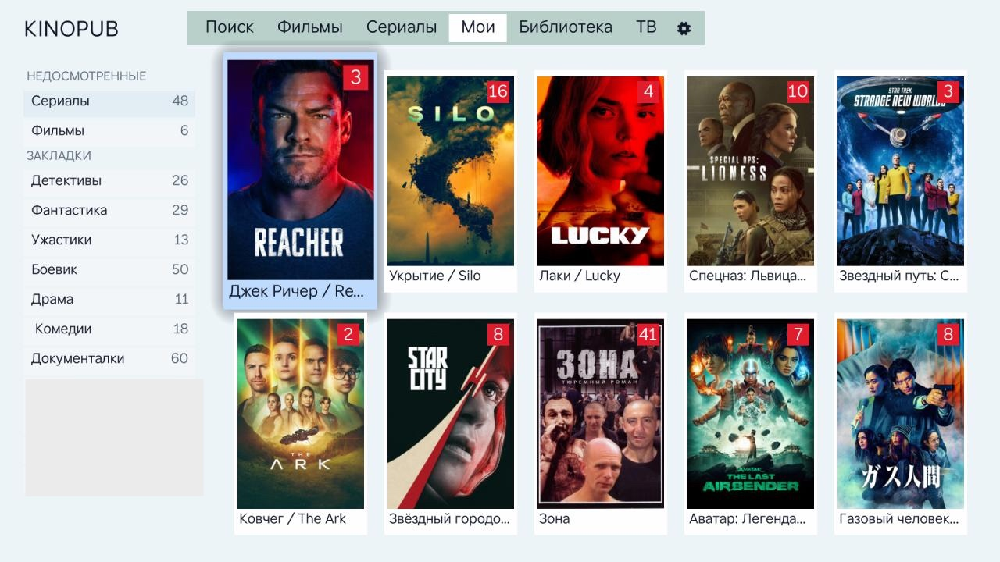
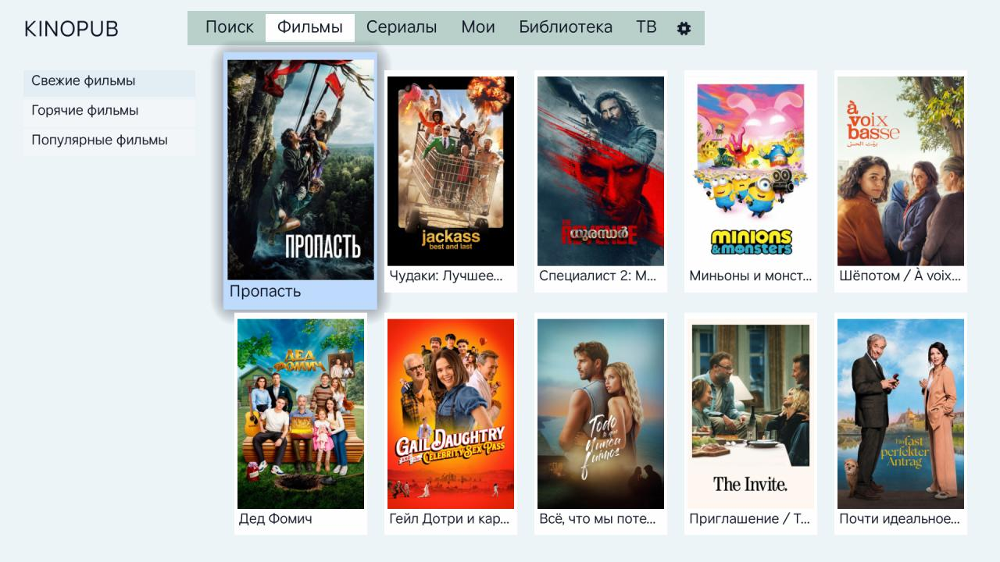
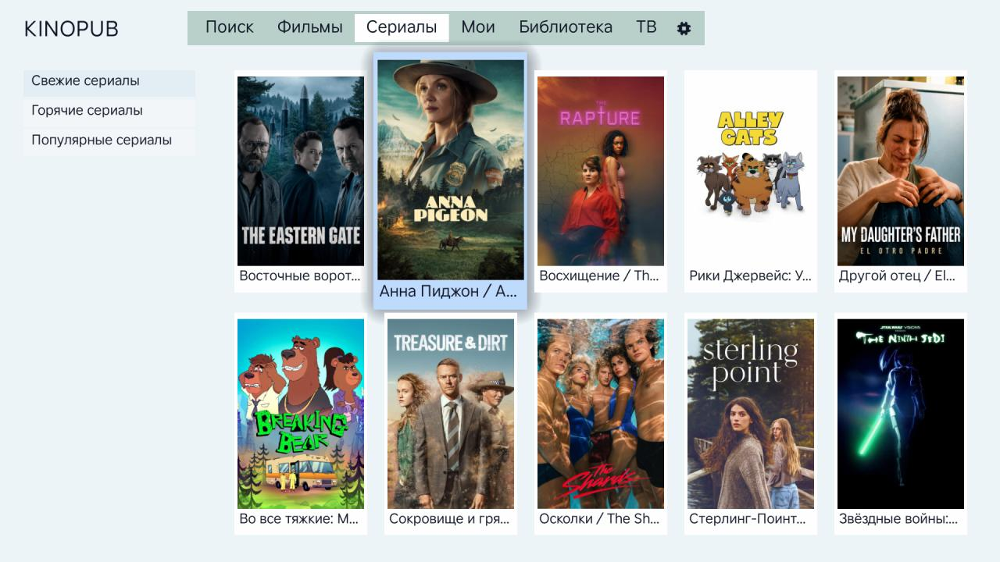
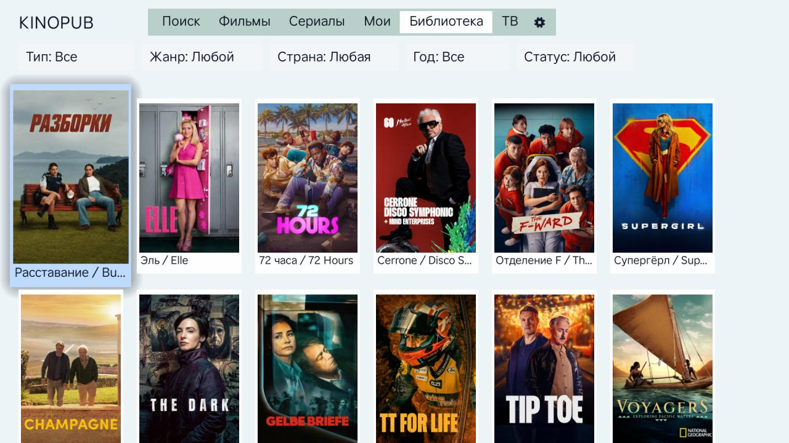
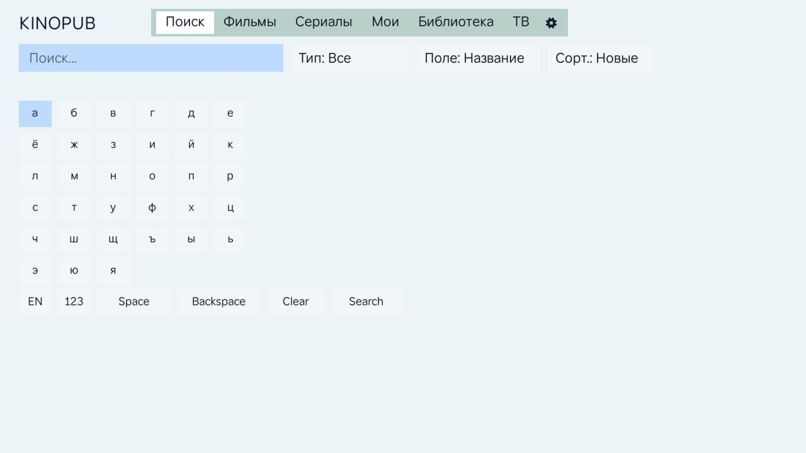
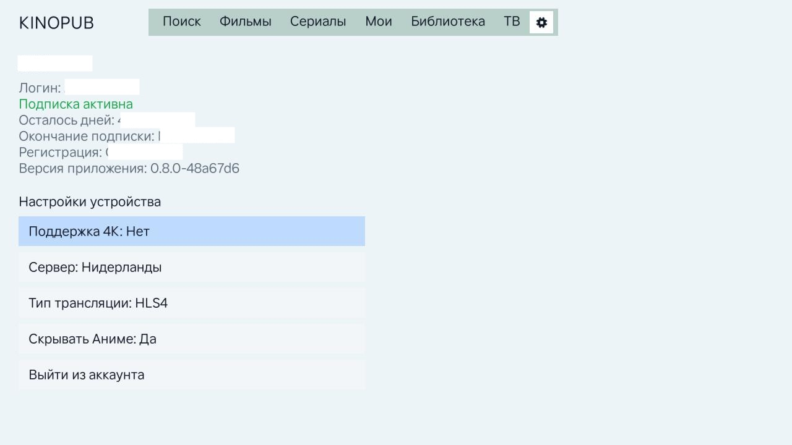

# KinoPub Roku Channel

A Roku SceneGraph channel for browsing and watching [KinoPub](https://kino.watch) content, built for sideloading onto a physical Roku device (no emulator, no build server).

The project started as a fork of [slimus/Kinopub](https://github.com/slimus/Kinopub) — itself tracing back to the archived [karpeychik/Kinopub](https://github.com/karpeychik/Kinopub) channel — but has since had its navigation, screens, and player rebuilt from the ground up, so very little of the original UI remains. This document describes the app as it exists today.

## What it does

- **Device-code sign-in** against the KinoPub OAuth flow, with automatic token refresh.
- **Continue Watching** ("Мои") — recently watched items and a "new episodes available" rail for subscribed serials, both deduplicated and paginated.
- **Movies / Series / Library** — a shared browse screen. Movies and Series use KinoPub's dedicated fresh/hot/popular shortcut lists; Library adds a full Тип / Жанр / Страна / Год / Статус filter bar over the general items endpoint.
- **Live TV** ("ТВ") — channel list and playback.
- **Search** ("Поиск") with recent-query history and a type filter.
- **Bookmarks** — folder-based, with an "add/remove" overlay from the video detail screen.
- **Watchlist** — a "Буду смотреть" toggle on serials, independent of bookmarks, backed by KinoPub's own subscribed-serials list.
- **Video detail** — seasons/episodes, recommendations, trailer playback, and a full metadata rail.
- **Settings** — account summary, device 4K/server/streaming-type settings, and an on-by-default "Скрывать Аниме" filter that hides anime-genre titles from every list (Movies, Series, Library, Search, Continue Watching, bookmarks) without touching explicit genre browsing.
- **Custom video player** — resume-from-position prompt, an icon-driven on-screen control row, a live "stats for nerds" overlay, and dedicated Audio/Subtitles/Quality panels. Audio and subtitle track choices are remembered per-series (not just per-episode), quality defaults to the best available HLS tier automatically, and AC3 audio tracks are filtered out since Roku hardware can't decode them. A quick "Сначала / Следующая серия" dialog (Down, when the OSD is hidden) restarts the current episode or jumps to the next one.

Screens are singletons created once by `AppScene` and toggled visible/hidden rather than recreated, with a shared `PillNavBar` for cross-tab navigation. A legacy dark-themed `HomeScreen` still exists in the tree but is no longer reachable from the UI — it's kept only as reference material.

## Screenshots

| | |
|---|---|
|  Continue Watching ("Мои") |  Movies |
|  Series |  Library, with the Тип/Жанр/Страна/Год/Статус filter bar |
|  Search |  Settings |

## Requirements

No package manager and no dependency install step. You need `bash`, `python3`, and `zip` on your machine, plus a physical Roku device in Developer Mode for testing (there is no emulator).

## Setup

### 1. KinoAPI credentials

```bash
cp config/kinoapi.example.json config/kinoapi.local.json
```

Edit `config/kinoapi.local.json` with a real `client_id` and `client_secret`:

```json
{
  "client_id": "your-client-id",
  "client_secret": "your-client-secret"
}
```

`config/kinoapi.local.json` is gitignored. If you don't have credentials, KinoAPI's [authentication docs](https://kinoapi.com/authentication.html) point to requesting them from `support@kino.pub`.

You can instead supply credentials via environment variables (`KINOAPI_CLIENT_ID` / `KINOAPI_CLIENT_SECRET`) without a local JSON file — this is how CI builds release packages.

### 2. Build the package

```bash
./scripts/package.sh
```

This regenerates `source/config/KinoConfig.brs` and `source/config/BuildInfo.brs` (both gitignored, generated — never hand-edit them) and produces `dist/kinopub.zip`. The package embeds a display version like `0.8.0-abcdef0`; override the pieces with the `APP_VERSION`, `APP_SHA`, or `PACKAGE_NAME` environment variables.

### 3. Enable Developer Mode on the Roku

1. From the home screen, press Home ×3, Up ×2, then Right, Left, Right, Left, Right.
2. Select **Enable installer and restart**.
3. Accept the Developer Tools License Agreement.
4. Set and confirm a device password, then select **Set password and restart**.
5. In a browser on the same network, go to `http://<roku-ip-address>` and log in with username `rokudev` and the password you just set.

### 4. Sideload

Upload `dist/kinopub.zip` on the installer page, then install and launch the channel.

## Development commands

| Command | Purpose |
|---|---|
| `./scripts/package.sh` | Full build — regenerates config/build-info and produces `dist/kinopub.zip` |
| `./scripts/generate-config.sh` | Regenerate `source/config/KinoConfig.brs` only |
| `./scripts/generate-build-info.sh` | Regenerate `source/config/BuildInfo.brs` only |
| `./scripts/verify-static.sh` | Static checks — required files present, BrightScript naming conventions, XML/manifest integrity. Run before committing |
| `scripts/tests/*.sh` | Focused regression checks (grep-based) for player/track-selection/next-episode behavior |

## Project layout

```
source/
  main.brs                 Entry point — creates AppScene
  services/                 Plain BrightScript objects wrapping each KinoPub API surface
                             (auth, home, browse, search, bookmarks, history, watching,
                             live TV, item detail, content types, user, device) plus local
                             registry-backed stores (tokens, player/search preferences,
                             app settings)
components/
  AppScene.*                 Root navigator — owns the screen stack
  screens/                   LoadingScreen, AuthScreen, ContinueScreen, BrowseScreen
                             (Movies/Series/Library), LiveScreen, SearchScreen,
                             SettingsScreen, VideoDetailScreen, PlayerScreen
  tasks/                     AuthTask, ContentTask — background threads for all network/
                             registry work, communicating back via observed fields
  nav/                       Shared PillNavBar
  dialogs/                   ExitConfirmDialog, ListPickerDialog (never take real focus)
  cards/, grid/, theme/      Shared poster-tile builder, virtualized grid pool, UI tokens
scripts/                     Build, config generation, and static verification
```

## Architecture notes

Roku SceneGraph runs the render thread and task threads in isolation; all network and registry I/O happens in `AuthTask`/`ContentTask` on background threads, and results come back to screens through observed SceneGraph fields — never direct calls across the thread boundary. `ContentTask` in particular is a single file dispatching on a `command` string, covering every content API call the app makes.

Full internals (screen flow diagram, per-service responsibilities, BrightScript conventions) are documented in `CLAUDE.md` for anyone — human or AI — picking up this codebase.

## CI / Releases

`.github/workflows/release-package.yml` builds and attaches `dist/kinopub.zip` to GitHub releases automatically on publish, using `KINOAPI_CLIENT_ID`/`KINOAPI_CLIENT_SECRET` repository secrets.
